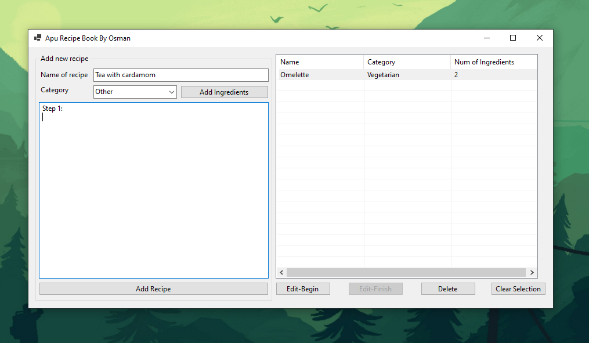
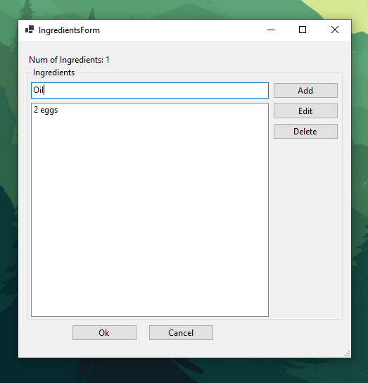

## Recipe Book Application

### Overview

This Recipe Book application is a Windows Forms desktop application designed to help users manage their recipes efficiently. Users can add, edit, and delete recipes, each containing a name, category, ingredients, and a description. The application allows the user to input a list of ingredients for each recipe and categorize them appropriately.

### Features

- Add a new recipe with a name, category, ingredients, and description.
- Edit an existing recipe, including its name, category, ingredients, and description.
- Delete a selected recipe from the list.
- View detailed information about a recipe, including its ingredients and description.

### Technologies Used

- **C#**: The primary programming language used for this application.
- **.NET 8**: Utilized for building the Windows Forms application.
- **Windows Forms**: Used for designing the graphical user interface (GUI).

### Screenshots

#### Main Form


#### Add Ingredients Form



### Classes

#### MainForm.cs
- **MainForm**: The main form of the application.

#### IngredientsForm.cs
- **IngredientsForm**: The form for adding and managing ingredients.
- 
#### Models
- **Recipe.cs**: Represents a recipe.

- **RecipeManager.cs**: Manages the list of recipes.

- **FoodCategory.cs**: Enum representing food categories.

### How to Run

1. **Clone the repository**:
   ```
   git clone https://github.com/Umid0vic/RecipeBook.git
   ```

2. **Open the solution in Visual Studio**:
   ```
   RecipeBook.sln
   ```

3. **Build the solution**:
   - Go to `Build` -> `Build Solution` or press `Ctrl+Shift+B`.

4. **Run the application**:
   - Press `F5` or go to `Debug` -> `Start Debugging`.
